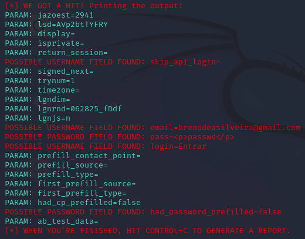

#  Phishing para captura de senhas do facebook
 
###	ferramentas
- Oracle VM  VirtualBox 
- Kali Linux
- setoolkit
 
 ###	Configurando  o Phishing no Kali Linux
 - Acesso root: ``` sudo su ```
 - Obtendo endereço da maquina: `` ifconfig ``
 - Iniciando o setoolkit: ``` setoolkit ```
 - Tipo de ataque : ``` Social-Engineering Attacks ```
 - Vetor de ataque: ``` Web Site Attack Vectors ```
 - Método de ataque: ``` Credential Harvester Attack Method ```
 - Método de ataque: ``` Site cloner ```
 - URL para clone:  http://www.facebook.com


### resultado




